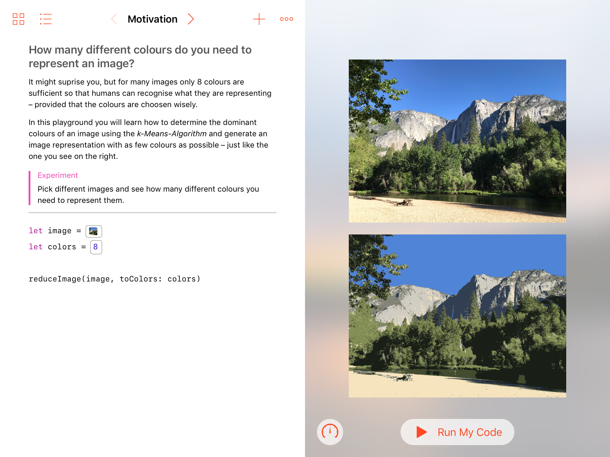
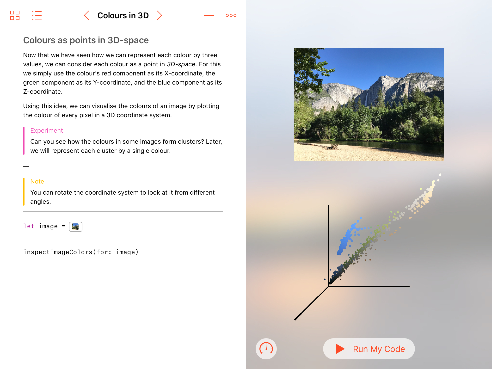
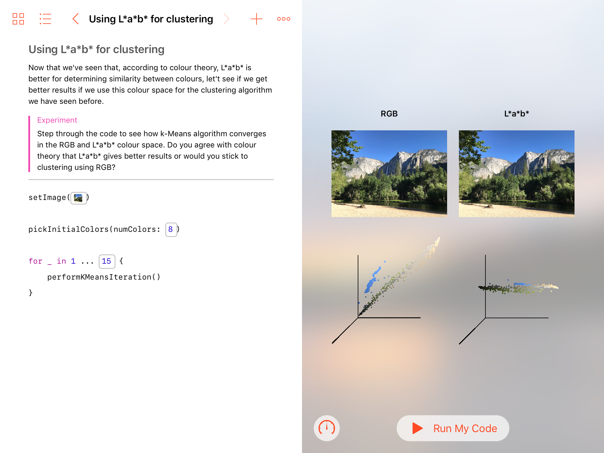

# Colour clustering playground

A playground I created for my WWDC 2019 scholarship application. It demonstrates on how the k-Means algorithm can be used to reduce an image to its primary colours.

For performance reasons it uses a set of Metal Performance Shaders to perform the k-Means algorithms.

